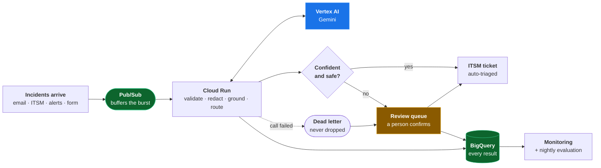
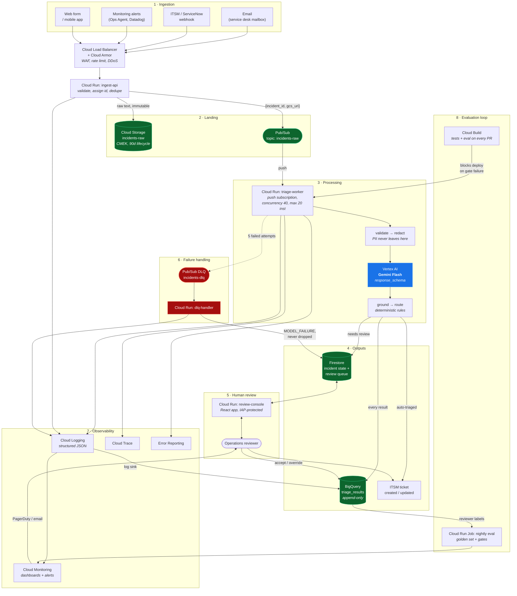

# Production architecture on GCP

Target load: **thousands of incidents per day**. Taking 5,000/day as the working
figure, that is an average of roughly 0.06 requests per second, with peaks
around shift changes and during a major outage — when one underlying fault
generates hundreds of reports in minutes.

That shape drives most of the decisions below. The steady-state load is
trivially small; the design exists for the **bursts**, the **failures**, and the
**auditability**, not for the average throughput. A system that handles 5,000
incidents a day comfortably and then loses fifty of them during the hour a
datacentre is on fire has failed at the only moment that mattered.

---

## Diagram

The whole system in one view. Every element the brief asks about is one box:
data enters top left, Pub/Sub triggers processing, Gemini is called from the
worker, the gate decides whether a human is needed, results land in BigQuery,
failures dead-letter to a person rather than disappearing, and monitoring reads
from the results table.

| The brief asks | Box |
|---|---|
| How data enters | **A** — email, ITSM webhook, monitoring alerts, web form |
| How processing is triggered | **B** — Pub/Sub push subscription |
| Where Gemini is used | **D** — Vertex AI, called only from the worker |
| Where it is stored | **I** — BigQuery (plus GCS for raw text, Firestore for queue state) |
| Where outputs are stored | **F** and **I** |
| How failures are handled | **H** — dead-letter queue routed to a human |
| How it is monitored | **J** — Cloud Monitoring and a nightly evaluation job |
| Where human review fits | **G** — a designed-in stage, not an exception path |

### The same thing in detail

---

## The flow, step by step

### 1. How data enters

Four realistic entry paths, all normalised to one internal shape by
`ingest-api` so the rest of the system has a single input contract:

| Source | Mechanism |
|---|---|
| Service desk mailbox | Pub/Sub push from Gmail API watch, or a mail-parsing Cloud Function |
| ITSM (ServiceNow, Jira SM) | Outbound webhook → HTTPS endpoint |
| Monitoring alerts | Webhook / Pub/Sub from the alerting platform |
| Web form or mobile app | Direct HTTPS |

**Cloud Load Balancer + Cloud Armor** sits in front for TLS termination, WAF
rules and per-IP rate limiting. The rate limit is not about cost — it is that a
misconfigured monitoring integration retrying in a loop is a far more likely
"attack" than a real one, and it would otherwise turn into a Gemini bill.

`ingest-api` does three things and nothing else: validate the envelope, assign
an `incident_id`, and **deduplicate**. Deduplication uses a content hash in
Firestore with a short TTL, because a mail loop or a webhook retry sending the
same report five times must not produce five tickets and five model calls.

### 2. Where it is stored

**Cloud Storage (`incidents-raw`)** holds the original, unmodified report,
encrypted with a customer-managed key. Writing the raw text down before
processing is what makes the pipeline replayable: when the prompt improves, six
months of real incidents can be re-triaged and the results compared. Without it,
every prompt change is a leap of faith.

**Firestore** holds live incident state and the human review queue. It is
chosen for its real-time listeners — the review console updates as incidents
arrive with no polling — and its low-latency single-document reads.

**BigQuery (`triage_results`)** is the append-only analytical record: every
result, every routing decision, every reviewer verdict. This is what evaluation,
dashboards and drift detection all read from.

### 3. How processing is triggered

Pub/Sub push subscription → Cloud Run. **Pub/Sub is the load-levelling buffer**,
and that is its real job here. When a major outage produces 400 reports in two
minutes, the queue absorbs the spike and Cloud Run drains it at whatever rate
Gemini quota allows. A synchronous design would either time out or hammer the
model API into rate limiting at the worst possible moment.

Since Pub/Sub is at-least-once, the worker is **idempotent**: it checks the
Firestore incident state before calling Gemini and skips work already completed.
Without that, a redelivery costs a duplicate model call and a duplicate ticket.

Cloud Run concurrency is set high (≈40 per instance). The work is almost
entirely waiting on a network call, so one instance can hold many in-flight
requests. Leaving concurrency at 1 would multiply the instance count — and the
bill — for no benefit.

### 4. Where Gemini is used

One place: `triage-worker`, after validation and redaction, via **Vertex AI**.

Model choice is a **Flash-tier model** — measured on `gemini-3.5-flash` and
`gemini-3.6-flash`. Triage is a short-context classification and extraction
task with a rubric supplied in the prompt, not a reasoning problem. Flash is
roughly an order of magnitude cheaper than Pro and materially faster, and both
Flash models cleared the baseline comfortably with zero critical misses (see
[EVALUATION.md](EVALUATION.md)). If a larger eval shows Flash failing on the
subtle cases, the escalation path is two-stage: Flash for everything, Pro
re-run only for low-confidence or security-adjacent incidents — most of Pro's
accuracy for a few percent of its cost.

**Pin an explicit model version, never a `-latest` alias.** An alias that
silently changes underneath you makes evaluation runs incomparable and turns a
model upgrade into an unannounced production change. Model retirement is real
and fast: `gemini-2.0-flash`, current when this was first written, now returns
404. Treat a model version like a dependency version — pinned, upgraded
deliberately, and re-evaluated on the golden set before promotion.

Two operational details that only surface on contact with the live API:

- **Thinking tokens count against `max_output_tokens`.** Gemini 3.x models
  reason before answering, and that budget is shared with the response. At
  1,024 tokens a triage record came back truncated mid-string after 980 tokens
  of reasoning — and no amount of constrained decoding rescues truncated JSON.
  The budget is now 2,048 and configurable.
- **Thinking cannot always be disabled.** `gemini-3.5-flash` accepts
  `thinking_budget=0` and answers in ~2s instead of ~9s; `gemini-3.6-flash`
  rejects it with a 400. The provider detects the rejection and retries without
  the setting rather than carrying a hardcoded capability table that goes stale
  the week a new model ships.

Structured output uses `response_schema` for constrained decoding, so malformed
JSON is not a failure mode that needs handling at scale.

### 5. Where outputs are stored

Every result goes to **BigQuery**, unconditionally, including failures and
rejections. Auto-triaged incidents also create or update the **ITSM ticket**.
Incidents needing review go to the **Firestore queue** instead, and only reach
ITSM once a human has confirmed them.

### 6. How failures are handled

Four layers, because failures differ in kind:

1. **In-process retry** — transient errors (429, 503, timeout) retried up to
   three times with exponential backoff and full jitter. Handles the common case
   without involving the platform.
2. **Pub/Sub redelivery** — if the worker crashes or NACKs, the message is
   redelivered with backoff, up to five attempts. Survives instance restarts and
   deploys.
3. **Dead-letter queue** — after five failed deliveries the message goes to
   `incidents-dlq`. A separate `dlq-handler` writes it to the human review queue
   flagged `MODEL_FAILURE`. **Nothing is ever dropped.** An incident the AI could
   not process is still an incident, and the failure mode to design out is not a
   bad triage — it is a report that silently disappears.
4. **Graceful degradation** — if Gemini is unavailable entirely, the worker
   keeps consuming and routes everything straight to human review. The service
   degrades to "manual triage with a queue", which is exactly where the client
   is today. It does not stop.

A DLQ depth above zero is an alert, not a dashboard number.

### 7. How it is monitored

Structured JSON logs (already implemented — see `observability.py`) flow to
Cloud Logging, with a sink into BigQuery for analysis. Log-based metrics feed
Cloud Monitoring dashboards and alerts:

| Alert | Threshold | Why it matters |
|---|---|---|
| DLQ depth | > 0 | An incident is stuck. Always urgent. |
| Failure rate | > 2% over 5 min | Model, quota or credential problem. |
| p95 latency | > 10s | Approaching the ingestion SLA. |
| Human review rate | outside 20–60% | Too high: no value delivered. Too low: the gate stopped working. |
| Review queue depth | growing 1h | Review capacity, not the model, is the bottleneck. |
| Category distribution shift | χ² vs 7-day baseline | Silent model or input drift. |
| P1 volume | 3× 7-day mean | Priority inflation, the classic slow failure. |
| Daily spend | > 1.5× budget | Runaway retries or a mail loop. |

Cloud Trace gives the latency breakdown (how much is Gemini, how much is ours),
and Error Reporting groups exceptions.

### 8. Where human review fits

Human review is **not an exception path**. It is a designed-in stage that
roughly 20–40% of incidents are expected to take, and the routing rules that
send them there are in `gating.py`:

- confidence below the automation threshold
- the model abstained (`UNKNOWN`)
- **any P1**, regardless of confidence
- **any security, safety or regulatory keyword**, checked against the raw report
  so a misclassification cannot disable the backstop
- quoted evidence that is not in the source
- two or more missing facts, contradictory output, or degraded input
- any model or transport failure

Reviewers work the Firestore queue through the React console (Cloud Run + IAP).
Each decision — accept or override — is written to BigQuery, which is what
turns the review workload into the evaluation dataset.

---

## Service choices and what was rejected

| Chosen | Why | Considered instead |
|---|---|---|
| **Cloud Run** | Scales to zero, scales out on burst, container gives dependency control, high concurrency suits IO-bound model calls, same image runs locally | **Cloud Functions** — is Cloud Run underneath now, with less control. **GKE** — real ops burden for a service this size. **Dataflow** — built for high-volume streaming transforms; per-item external API calls are an awkward fit and the cost floor is far higher. **Cloud Workflows** — orchestration for multi-step flows; this is one step. |
| **Pub/Sub** | Load levelling for bursts, at-least-once delivery, native DLQ and retry policy, decouples ingestion from processing | **Cloud Tasks** — good for per-task rate control, weaker fan-out and no equivalent DLQ ergonomics. **Direct HTTP** — no buffer; the outage burst becomes dropped requests. |
| **Vertex AI Gemini** | IAM instead of a shared API key, VPC Service Controls, CMEK, regional data residency, provisioned throughput available, billing in the same project | **Gemini Developer API** — fine for the PoC (and supported by the same code), but a long-lived key is a poor fit for production data governance. |
| **Gemini 2.0 Flash** | Classification against a supplied rubric; cheap and fast, with an escalate-to-Pro path if evaluation demands it | **Gemini Pro** — better on subtle cases, ~10× the cost for every incident including the 60% that are trivial. **Fine-tuned smaller model** — no labelled data yet; revisit after 6 months of reviewer decisions. |
| **Firestore** | Real-time listeners for the review console, low-latency document reads, serverless | **Cloud SQL** — needs instance management and has no push updates. **Memorystore** — durability matters here. |
| **BigQuery** | Cheap append-only analytics, native log sink target, SQL for evaluation and drift queries | **Cloud SQL** — poor fit for analytical scans. **Bigtable** — wrong access pattern; this is analytical, not key-value. |
| **Cloud Storage for raw text** | Replayability of the whole corpus against a new prompt; CMEK; lifecycle rules | Storing raw text only in BigQuery — mixes sensitive source data into the analytical layer that many more people can query. |
| **Cloud Armor** | A looping integration is the realistic threat, and rate limiting is the control | No WAF — leaves a public endpoint that converts directly into model spend. |

---

## Security and sensitive data

- **Redaction before egress.** PII is replaced with typed placeholders before
  the text reaches Vertex AI, and only the redacted text is logged. Raw text
  lives in one CMEK-encrypted bucket with a tight IAM policy.
- **No content in logs.** Logs carry a SHA-256 fingerprint of the input, never
  the input. Logs fan out to sinks and exports and are read by far more people
  than the source system ever grants access to.
- **IAM, not keys.** Each service runs as its own service account with least
  privilege: the worker can read the raw bucket, write BigQuery and call Vertex
  AI, and nothing else. No long-lived API keys in production.
- **VPC Service Controls** around the project to prevent data egress to
  non-approved services.
- **IAP** on the review console, so reviewer identity is a Google identity and
  every decision is attributable.
- **Prompt injection** is treated as an input-handling problem: the report is
  fenced, declared untrusted in the system instruction, its fence markers are
  neutralised, and constrained decoding means the worst case is a wrong field
  value inside a valid schema, not arbitrary model behaviour. Detected
  injection attempts are flagged for human review rather than blocked, since the
  report may still describe a genuine incident.
- **Data residency.** Vertex AI is pinned to a specific region; the Developer
  API offers no equivalent guarantee.
- **Retention.** Raw incidents expire on a lifecycle rule (90 days to archive);
  BigQuery results are retained for trend analysis with PII already removed.

---

## Indicative cost at 5,000 incidents/day

Measured cost on the live runs was **~$0.00015–0.00017 per incident**, using
the indicative rates configured in `config.py` (these are placeholders — set
them from the current published price list before budgeting, and note that
thinking tokens bill as output).

| Item | Monthly at 5,000/day |
|---|---|
| Gemini Flash (~$0.00016 × 150,000 incidents) | ~$25 |
| Cloud Run (worker + console, mostly idle) | ~$15 |
| Pub/Sub, Firestore, BigQuery, GCS at this volume | ~$10 |
| **Total** | **~$50/month** |

One caveat the measured runs surfaced: at ~15s per incident with reasoning
enabled, a single worker processes ~4 incidents/minute. 5,000/day needs roughly
one instance running continuously, or fewer with `thinking_budget=0` where the
model supports it. Concurrency is what makes this cheap — the work is almost
entirely waiting.

The model is not the cost. This is the number that makes the business case:
against the salary cost of manually reading 5,000 reports a month, an
infrastructure spend of this size is a rounding error — which means the argument
for the system rests entirely on whether the output is **good enough and safe
enough**, not on whether it is cheap. Hence the weight given to evaluation.

---

## What I would build next

1. **Retrieval over past incidents.** Embed resolved incidents in Vertex AI
   Vector Search and give the model the five most similar ones. Grounding
   "recommended next action" in what actually resolved this before is worth more
   than any further prompt tuning.
2. **Two-stage escalation.** Flash first; re-run low-confidence and
   security-adjacent incidents on Pro. Cheap accuracy where it matters.
3. **Batch mode for backlog.** Vertex AI batch prediction at roughly half the
   price for anything not time-sensitive.
4. **Automatic prompt regression gates.** Shadow-run a candidate prompt on 5% of
   live traffic, compare against the current one on the golden set, and require
   a human sign-off before promotion.
